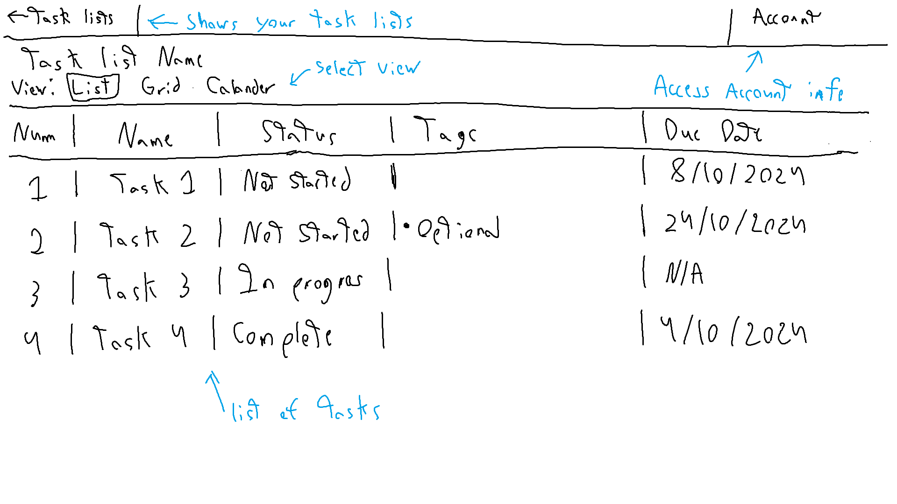
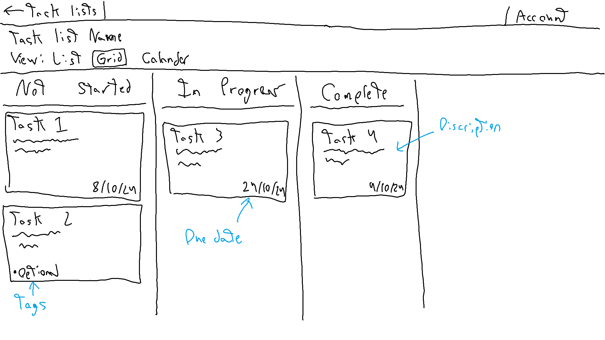

## Description  

Users can create an account to create and manage task lists. In a task list users can add and manage tasks. They will be able to view the task in a list view, grid view and calander view. List view will allow users to order their tasks by number and sort by due date, status and tags. Grid view will display each task in a column based on their status. Calander view will display dates and how many tasks are due on a date. All views will allow for filtering options based on status and tags. Users can add other users to their task list to view or manage the tasks.  
The application will have a database of all user accounts, task lists and each lists tasks. Accounts will contain the username and password as well as what task lists they have access to. Taks lists will contain all tasks in that list and users who have access and their permissions. Task will contain a name, discription, number and status and can contain tags and due dates.

### Screens  

## Features

|ID |Name|Short Description|Server or Client|
|--|----|---------|---------|
|01|Entering tasks|User creates new task|Both|
|02|Task Descriptions|User adds description to task|Both|
|03|List View|View all tasks in a list format|Client|
|04|Board View|View all tasks in board format|Client|
|05|Task Due date|User add due date to tasks|Both|
|06|Task Tags|User create tags and apply tags to task|Both|
|07|Update Task|User updates status of task|Both|
|08|Task history|Database saves task history|Server|
|09|View history|User can view history of tasks|Client|
|10|Calander View|View calander with dates of due tasks|Client|
|11|Task Filter|Filter tasks by tags or status|Client|
|12|Sort List|Sort list based on status,due date,number or tags|Client|
|13|Invite User|Invite other user to task list|Both|
|14|User permissions|Manage if user can add or update tasks|Both|
|15|Manage Task List|Manage what task lists each user has access to|Server|
|16|User Accounts|Store and manage user accounts in database|Server|
|17|User Regestration|User can regester their account to save task lists|Both|
|18|User Login|User can login to their account to view task lists they have access to|Client|
|19|Number tasks|User can order tasks by number|Both|
|20|Detailed task view|Clicking on task will display detailed view of task including description|Client|
|21|Create task list|User can create new task list|Both|
|22|Name task list|User can name a task list|Both|
|23|Delete tasks|User can delete a task and all history if needed|Both|
|24|Delete task lists|User can delete a task list if needed|Both|
|25|Public view|Users can allow their task list to be viewed by users without an account|Both|

## Implementation

### Tools and packages

* nodejs for server implementation
* mongo database server

### App API  

1. GET /tasklist?id=*tasklistid*
* responds with task list

2. GET /task?tasklist=*tasklistid*&id=*taskid*
* responds with task

3. POST /newtask
* posts new task

4. POST /updatetask
* updates task information

